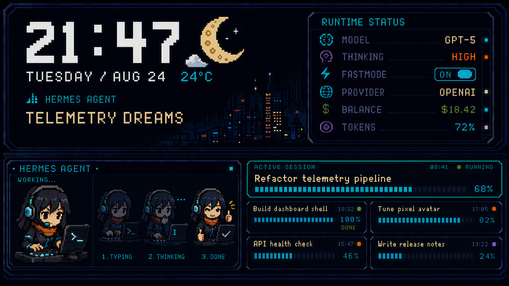

# Hermes Dashboard

这是一个不依赖 Xcode 工程的原生 macOS AppKit dashboard，设计画布固定为 1280×720，并在启动时以全屏窗口显示。窗口隐藏 Dock 和顶部菜单栏，实际显示器尺寸不同于 1280×720 时，会在内部按 16:9 画布等比缩放；画布上下区域按 7:9 比例分割。

## 最终目标设计图



这张图是 UI 目标稿；Hermes Agent 区域只显示一个最大的实时像素小人，并根据当前运行状态切换动作与状态文案，设置窗口可替换字体、图标与 GIF 壁纸。

## 构建与运行

```sh
./build.sh
open build/HermesDashboard.app
```

运行期间可以点击 Runtime Status 标题右侧的齿轮按钮，或按 `S` / `⌘,` 打开设置窗口，按 `Esc` 或 `⌘Q` 退出。快捷键由应用级事件分发处理，即使全屏窗口的第一响应者暂时变化也能生效；在设置输入框中输入 `S` 不会误触发。鼠标启动时保持可见，停止活动 10 秒后自动隐藏，再次移动或点击会立即显示。

## 字体、颜色与字号

设置窗口的 `TEXT STYLE OVERRIDES` 区域可以分别修改这些位置：Clock、Date、Temperature、Now Playing Artist、Now Playing Title、Runtime Status、Hermes Agent、Active Session Header、Active Session Name、Recent Sessions。`Active Session Header` 和 `Active Session Name` 是两个独立选项，分别控制模块标题和当前 session 名称。每一项都支持 X/Y 画布坐标、字体、字号和颜色；面板内文字的坐标相对于对应面板原点。

- `Silkscreen-Regular` / `Silkscreen-Bold`：随 App 打包的开源像素字体，默认用于目标稿风格
- `Pixel Grid (built-in)`：兼容旧版本的内置 8bit 字体
- 系统已安装字体，或用 `Load Font…` 临时注册 `.ttf` / `.otf` / `.ttc`
- 字号
- 颜色

修改后即时生效并保存到应用偏好设置；`Reset Text Styles` 恢复预览图默认样式。

点击 `Layout / Opacity…` 可以修改整个画布的上下左右 padding、Runtime Status / Hermes Agent / Active Session 三个模块的 X/Y 坐标，以及三个模块背景透明度。修改会立即生效并保存到下次启动。

## 可替换天气与 Agent 图标

在设置中选择 `WEATHER / AGENT ASSET FOLDER`，程序会读取用户指定目录下的 PNG、JPG 或 GIF：

```text
weather-clear.png       weather-cloudy.png
weather-rain.gif        weather-snow.png
hermes-working.png      hermes-thinking.gif
hermes-done.png         hermes-error.png
```

也可以放入 `weather/`、`hermes/`、`agent/` 或 `icons/` 子目录。Agent 会优先按当前状态寻找 `hermes-working`、`hermes-thinking`、`hermes-done` 等文件，GIF 会按原始帧时长播放；找不到时自动回退到内置像素图标。

## Runtime Status 数据

设置窗口可以切换 Codex Desktop 和 Hermes Agent。程序会按下面的顺序查找状态文件：

- `~/Library/Application Support/Codex/status.json`
- `~/Library/Application Support/HermesAgent/status.json`
- `~/Library/Application Support/Hermes Dashboard/codex.json`
- `~/Library/Application Support/Hermes Dashboard/hermes.json`

也支持环境变量 `CODEX_DASHBOARD_STATUS_PATH` 和 `HERMES_DASHBOARD_STATUS_PATH` 指向自定义 JSON。示例见 [status.example.json](status.example.json)。

`active session` 的进度优先使用 `contextUsedTokens / contextLimitTokens` 计算，正是当前上下文占比；没有 token 数时才使用 `contextPercent`。

当 Runtime Status 来源选择 `Codex Desktop` 时，Active Session 会读取 `~/.codex/session_index.jsonl`，按更新时间排序并展示最近 5 个 Codex 任务；任务标题和最近更新时间会实时刷新。

## 系统数据源

- Apple Music：通过 macOS Apple Events 读取当前歌曲、歌手、播放状态和进度。首次使用可能需要在“系统设置 → 隐私与安全性 → 自动化”允许 Hermes Dashboard 控制 Music。
- Weather：先读取 macOS Weather 的本地缓存；缓存不可用时尝试读取 Weather.app 的辅助功能树。若 macOS 没有授予辅助功能权限，则使用最后可用/设计稿示例值。权限位置是“系统设置 → 隐私与安全性 → 辅助功能”。

## GIF 壁纸

按 `S` 打开设置，选择本地 GIF。GIF 会以低透明度绘制在 dashboard 后方，并按照原始帧时长播放；点击 `Clear` 后恢复内置像素夜景背景。资源文件夹也可随时点击 `Clear` 恢复内置天气与 Agent 图标。

## 默认显示器

设置窗口的 `DEFAULT DISPLAY` 下拉菜单会列出当前连接的所有显示器。选择后 Dashboard 会立即移动到对应屏幕，并在后续启动时继续使用该屏幕；如果所选显示器暂时未连接，程序会回退到 macOS 主屏幕。
